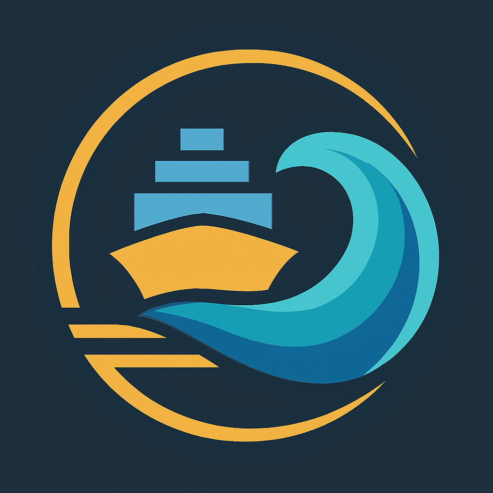

  

<!--
Autor: Fabio Weidner
Version: 1.0
Sektion: Infrastruktur – Auroraexpress_Wasser
Veröffentlichung: April 2025
-->

# 🚢 03 – Fahrzeuge & Antriebe im Auroraexpress_Wasser-System

---

## 🚛 Übersicht der Schiffsklassen

Auroraexpress_Wasser nutzt vier Hauptklassen von Wasserfahrzeugen,  
alle vollständig emissionsfrei, modular und systemintegriert:

| Klasse | Zweck | Besonderheit |
|--------|-------|--------------|
| **A-Klasse** | Großraumfrachter | Nur Güter, vollautonom, mit FTH-Kopplung |
| **B-Klasse** | Kombischiffe | Getrennte Bereiche für Güter und Personen |
| **C-Klasse** | Schnellfähren | Nur Personen, Hochgeschwindigkeitsverbindungen |
| **D-Klasse** | Notfall- & Hilfseinheiten | Spezialmodule für Rettung, Versorgung, medizinische Einsätze |

---

## 🧠 Autonomiestufen

| Stufe | Beschreibung |
|-------|--------------|
| **A1** | Vollautonom mit KI-Routing, kein Mensch an Bord |
| **A2** | Autonom, aber mit technischem Sicherheitspersonal (z. B. Pilot im Bereitschaftsmodus) |
| **A3** | Teilautonom, Fernüberwachung durch Zentrale, manuelle Überbrückung möglich |
| **A4** | Sonderbetrieb: Manueller Notfallbetrieb z. B. bei externen Störungen oder Krisen |

---

## ⚡ Energieprofile

Auroraexpress_Wasser verfolgt eine kombinierte Strategie zur Energieversorgung:

### 🌞 Solardecks
- Integrierte Solarflächen auf allen Schiffen
- Nutzung von Lichtreflexion über Wasser optimiert den Ertrag

### 💨 Wellen- & Strömungskoppler
- Mechanische Energiegewinnung durch Schiffsdynamik
- Vor allem bei Langstreckenfrachten relevant (A- & B-Klasse)

### 💧 Wasserstoff-Hybridsysteme
- Interne Brennstoffzellen zur Spitzenlastabdeckung & Nachtbetrieb
- Betankung an spezialisierten Docks mit Gezeitenenergieunterstützung

---

## 🧩 Modulkopplung

- Alle Frachtschiffe nutzen das **standardisierte Aurora-Modulsystem**
- Übergabe zwischen Luft ↔ Wasser ↔ Boden ohne Umladung möglich
- Durchlaufcontainer kompatibel mit Schienen-, Flug- und Tunnelverbindung

---

## 🔐 Sicherheitslogik

- Schiffe verfügen über interne **Zonensensorik und Zugangsmanagement**
- Alle Passagierbereiche in C- & B-Klasse sind **abschottbar und eigenständig belüftet**
- KI-Betrieb wird permanent überwacht, Statusmeldung an Aurora-Infrastruktur-Zentrale

---

## 🛠 Wartung & Redundanz

- Selbstdiagnosesysteme auf jedem Schiff
- Autonome Wartungseinheiten im Dock oder per FTH-Zusatzmodul
- Redundante Steuerprotokolle für Kurskorrekturen bei Notfällen

---

✅ Abgeschlossen  
📅 Stand: 29.04.2025  
🏩 Zuständig: Gruppe Auroraexpress  
🔐 Freigegeben für Fahrzeugflottenplanung, Dockdesign & Routensteuerung
