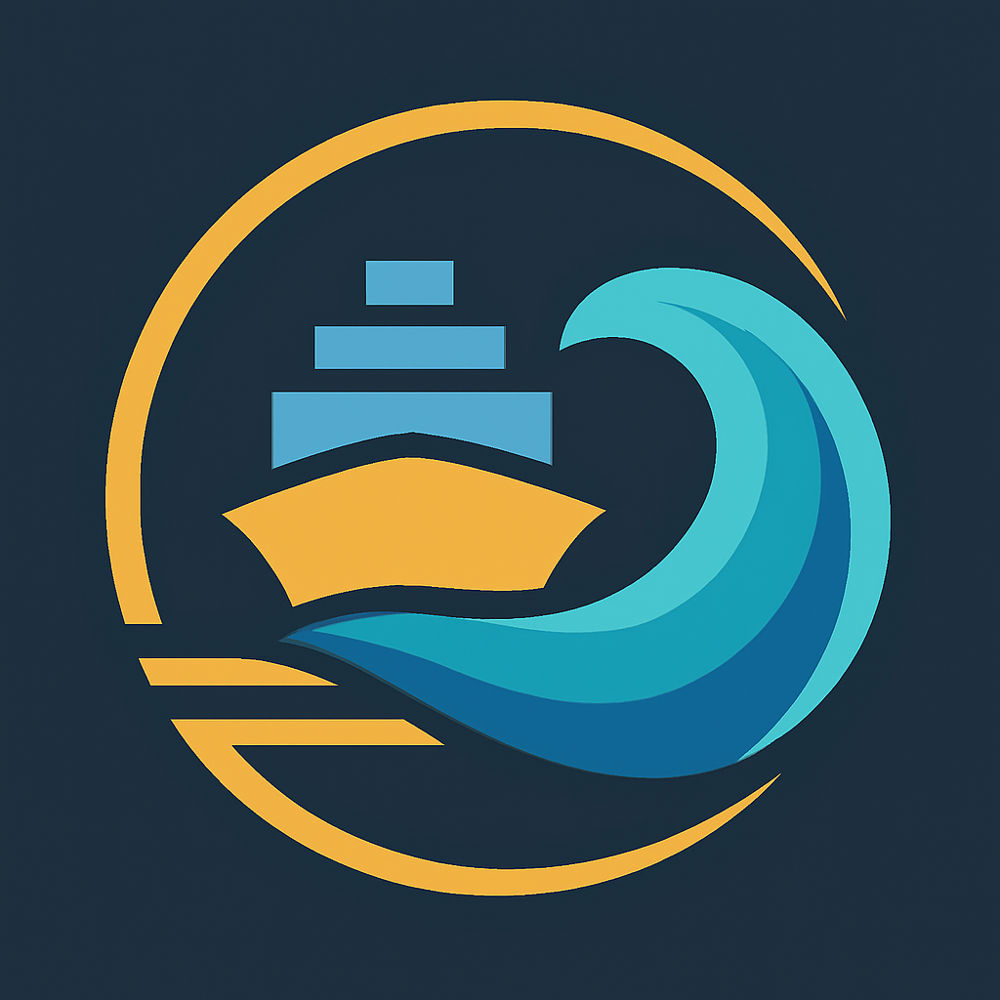

  

<!--
Autor: Fabio Weidner
Version: 1.0
Sektion: Infrastruktur – Auroraexpress_Wasser
Veröffentlichung: April 2025
-->

# 🧭 04 – Netzsysteme & Routen im Auroraexpress_Wasser-System

---

## 🌍 Netzlogik

Auroraexpress_Wasser ist in ein globales, **dynamisch steuerbares Liniensystem** gegliedert.  
Es basiert auf Nachfrage, geopolitischer Stabilität, Klimaeinflüssen und Infrastrukturanbindung.

---

## 🚢 Linienstruktur

| Linie | Beschreibung |
|-------|--------------|
| **Nord-Süd** | Versorgungslinien mit Frischwaren, Spezialgütern und Expresscontainern |
| **Ost-West** | Schwerlastverbindungen für Industrie, Großmärkte, Zwischenhubs |
| **Diagonalrouten** | Krisen- oder Sonderlinien, aktivierbar bei Engpässen |
| **Inlandslinien** | Für Inselregionen, Binnenmeere, küstennahe Versorgung |
| **FTH-Verbindungen** | Hochseeverbindungen zu Floating Transfer Hubs mit Langstreckenmodulen |
| **Passagiernetz** | Separates Routing, nur auf C- & B-Klasse, mit eigener Taktung & Routenlogik |

---

## 🛳 Knotenpunkte

| Knotentyp | Funktion |
|-----------|----------|
| **Primärhafen (Z1–Z5)** | Vollausgestattet, alle Klassen, Multimodalknoten |
| **Sekundärhafen** | Personenverkehr + Teilumschlag, keine Großfrachter |
| **Minihafen** | Nur C-Klasse (z. B. Inselverbindung), automatisiert |
| **FTH (siehe 05)** | Hochseeplattform mit Andockzonen für Langstrecke & Notfälle |

---

## 🧠 Routing & Matching

- Zentrales Matching-System optimiert Linien je nach:
  - Frachtart
  - Energiebedarf
  - Wetterlage
  - Seestraßensicherheit
  - Hafenverfügbarkeit

- Alle Linien werden **dezentral gefahren, aber zentral überwacht**
- Priorisierung nach Versorgungskritikalität & Energieeffizienz

---

## 🔄 Intermodale Kopplung

| Zielsystem | Schnittstelle |
|------------|---------------|
| **Auroraexpress_Boden** | Hafenbahn, Untergrundverbindung, Dock-Tunnel |
| **Auroraexpress_Luft** | Z5-Kopplung: Spezialdock oder FTH |
| **AuroraApp** | Echtzeitbuchung & Verfolgung für Personen- und Gütertransporte |

---

## 🛂 Personenverkehrsnetz

- Ausschließlich auf C- & B-Klasse (Z3 & Z4 Zugang)
- Eigene Slotvergabe & Check-in-Struktur
- Sicherheitszonen mit DockSafe-Trennung
- Buchung nur mit digitalem Reisemodul (AuroraApp, Gruppenpass oder Sammeltransit)

---

## 🚨 Notfalllinien & Krisennetz

- Redundante Linien auf Abruf (z. B. bei Blockade, Naturkatastrophe)
- Aktivierung durch Krisenrat oder System-KI
- FTH kann als Umschlags- oder Umstiegspunkt fungieren

---

✅ Abgeschlossen  
📅 Stand: 29.04.2025  
🏩 Zuständig: Gruppe Auroraexpress  
🔐 Freigegeben zur Implementierung & Vernetzung mit Land/Luft-System
