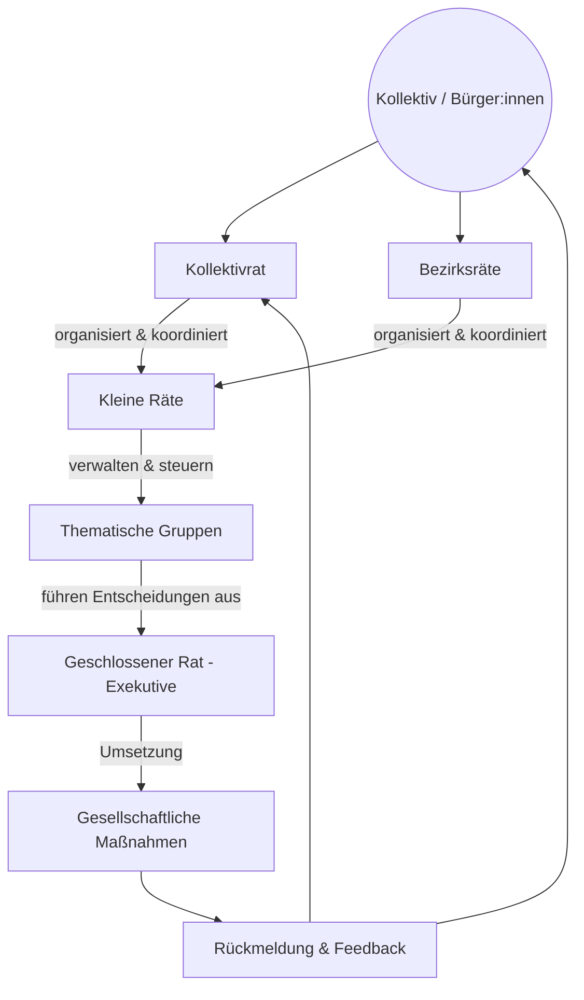
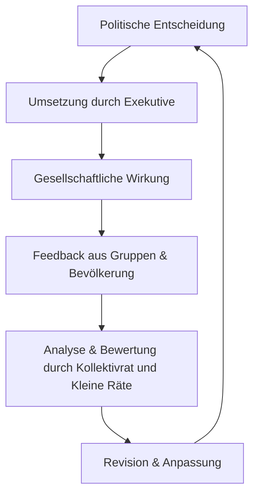

  

<!--
Autor: Fabio Weidner
Version: 1.2
Sektion: Meta & Systemstruktur
Veröffentlichung: Mai 2025
-->

# 🗺️ Visualisierung der Systemlogik der Kollektiven Räterepublik

> 📚 Dieses Dokument stellt die zentralen Prozesse und Strukturen der Kollektiven Räterepublik in grafisch orientierter Form dar – zur besseren Verständlichkeit des politischen Gesamtmodells.

---

## 🧭 Einleitung

Die Kollektive Räterepublik basiert auf einem systemisch rückgekoppelten Kreislaufmodell. Statt linearer Entscheidungswege folgen die Prozesse einer zirkulären Logik aus Wahl, Umsetzung, Kontrolle und Rückbindung.

---

## 🔄 Zyklus der politischen Mitbestimmung

---

## 🏛️ Institutionelle Übersicht

```mermaid
graph LR
    subgraph Basis
        Bürger[Kollektiv / Bürger:innen]
    end
    subgraph Politische Ebene
        Kollektivrat
        Bezirksräte
        KleineRäte[Kleine Räte der Gruppen]
    end
    subgraph Exekutive
        GeschlossenerRat[Geschlossener Rat]
    end
    subgraph Gruppenebene
        Außenpolitik
        Bildung
        Kunst
        Infrastruktur
        Auroraexpress
        Unterhaltung
        ForschungInnovation[Forschung & Innovation]
        Ernährung
        Gesundheit
        IntegrationMigration[Integration & Migration]
        WirtschaftProduktion[Wirtschaft & Produktion]
        Digitalisierung
        JustizRecht[Justiz & Recht]
        UmweltKlima[Umwelt & Klima]
        Kultur
        Sicherheit
        VerwaltungStruktur[Verwaltung & Struktur]
    end
    subgraph Judikative
        Tribunalgericht
        Bezirksgericht
    end

    Bürger --> Kollektivrat
    Bürger --> Bezirksräte
    Kollektivrat --> KleineRäte
    Bezirksräte --> KleineRäte
    KleineRäte --> Gruppenebene
    Gruppenebene --> GeschlossenerRat
    GeschlossenerRat -->|Umsetzung & Koordination| Gruppenebene
    Bürger --> Tribunalgericht
    Bürger --> Bezirksgericht
```

---

## 📦 Entscheidungspfade & Rückkopplung

---

## 📌 Fazit

Die Visualisierung zeigt: Die Kollektive Räterepublik ist ein System zyklischer Politik – nicht Top-down, sondern feedbackbasiert, lernfähig und kollektiv getragen.

---
