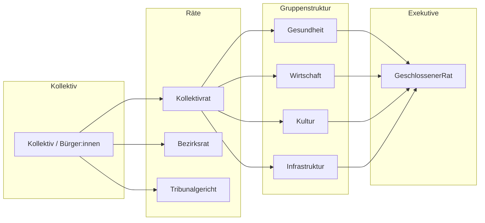
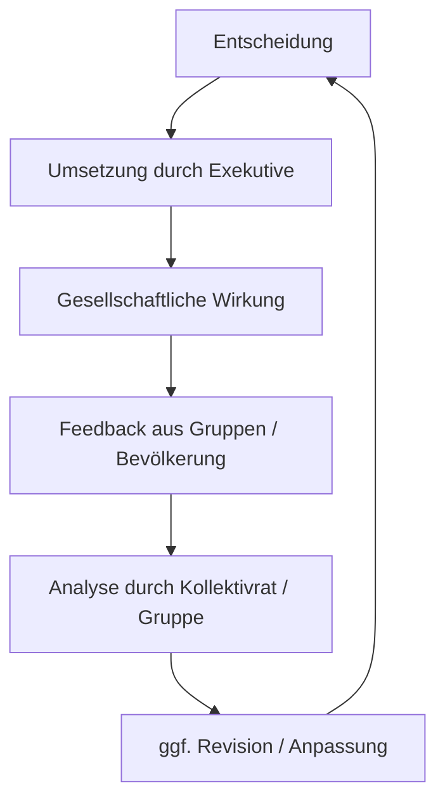

<!--
Autor: Fabio Weidner
Version: 1.0
Sektion: Meta & Systemstruktur
Veröffentlichung: April 2025
-->

# 🗺️ Visualisierung der Systemlogik der Kollektiven Räterepublik

> 📚 Dieses Dokument stellt die zentralen Prozesse und Strukturen der Kollektiven Räterepublik in grafisch orientierter Form dar – zur besseren Verständlichkeit des politischen Gesamtmodells.

---

## 🧭 Einleitung

Die Kollektive Räterepublik basiert auf einem systemisch rückgekoppelten Kreislaufmodell. Statt linearer Entscheidungswege folgen die Prozesse einer zirkulären Logik aus Wahl, Umsetzung, Kontrolle und Rückbindung.

---

## 🔄 Zyklus der politischen Mitbestimmung

```mermaid
graph TD
    Kollektiv((Kollektiv)) --> Kollektivrat[Kollektivrat]
    Kollektiv --> Bezirksrat[Bezirksrat]
    Kollektivrat -->|organisiert| Gruppenstruktur
    Bezirksrat -->|organisiert| Gruppenstruktur
    Gruppenstruktur --> Gruppen[Thematische Gruppen]
    Gruppen --> KleineRaete[Kleine Räte + Vorsitzende]
    KleineRaete --> GeschlossenerRat[Geschlossener Rat (Exekutive)]
    GeschlossenerRat -->|Umsetzung| Maßnahmen
    Maßnahmen --> Rückkopplung[Rückmeldung aus Bevölkerung & Gruppen]
    Rückkopplung --> Kollektivrat
    Rückkopplung --> Kollektiv
```

---

## 🏛️ Institutionelle Übersicht



---

## 📦 Entscheidungspfade & Rückkopplung



---

## 📌 Fazit

Die Visualisierung zeigt: Die Kollektive Räterepublik ist ein System zyklischer Politik – nicht Top-down, sondern feedbackbasiert, lernfähig und kollektiv getragen.

---


